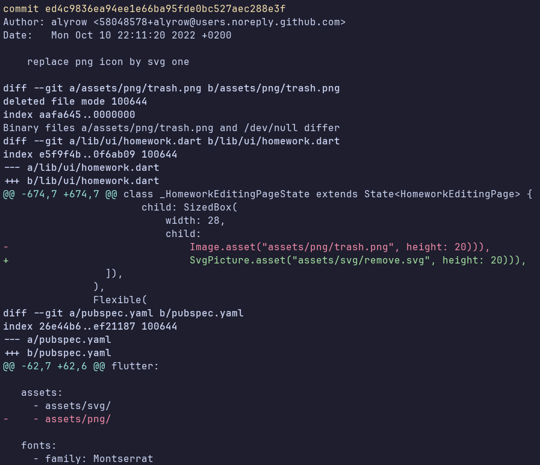
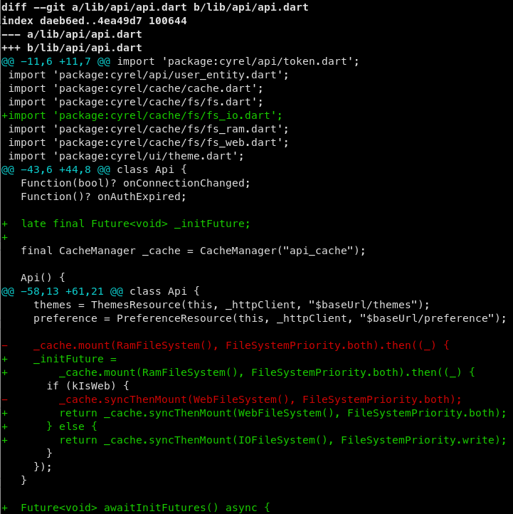

# Git

Ou l'art de versionner son code


---

## Qu’est-ce que GIT ?

- Système de gestion de versions de code (ou autres fichiers)
- Garde l’historique de toutes les modifications faites
- Conçu pour le travail en équipe
- Utilisé pour développer le kernel linux
- Système de branche qui permet de travailler sur des espaces isolé et séparé

---

## Hébergeurs GIT

- GitHub : Plateforme la plus connue
- Gitlab :
  - On peut héberger sa propre instance
  - Gitlab de l’école : [https://gitlab.etude.cy-tech.fr/](https://gitlab.etude.cy-tech.fr/)
- Review de code
- Fonctionnalité de build automatisé
- Liste de tâche, de problèmes

---

## Comment accéder à un hébergeur depuis son ordi ?

Avec une clée [ssh](https://fr.wikipedia.org/wiki/Secure_Shell): 

- Fonctionne sur un système de clé publique, clé privée
- Plus solide qu’un mot de passe

On va générer une clée ssh et l’ajouter dans le gitlab de l’école

---

## Comment accéder à un hébergeur depuis son ordi ?


- Génération de la clé ssh

```sh
$ ssh-keygen -t ed25519 -C "login@cy-tech.fr"
```

- Le programme va vous demander où stocker la clée, par défaut il la met à l’emplacement /home/cytech/.ssh/id_ed25519
- Entrez un mdp si vous le souhaitez pour protéger votre clée en local
- 2 fichiers sont créés :

```
~/.ssh/id_ed25519 (clée privée)
~/.ssh/id_ed25519.pub (clée publique)
```

---

## Comment accéder à un hébergeur depuis son ordi ?

- ssh-agent
  - Gère toutes clés ssh
  - GIT et d’autres outils qui utilisent les clés ssh passent par lui pour savoir quelle clé utiliser
- Démarrage de ssh-agent
  - Sur des machines avec des environnements graphiques tels que GNOME, KDE… il est démarré automatiquement
  - Démarrage manuel :

```sh
$ eval $(ssh-agent)
```

---

## Comment accéder à un hébergeur depuis son ordi ?

- Ajoutons la clé ssh dans ssh-agent

```sh
$ ssh-add ~/.ssh/id_ed25519
```

- Ajoutons la clé ssh dans l’instance gitlab de l’école
  - [https://gitlab.etude.cy-tech.fr/](https://gitlab.etude.cy-tech.fr/)
  -  Utilisez les identifiants de l’université pour vous connecter

---

## Comment accéder à un hébergeur depuis son ordi ?


---

## Comment accéder à un hébergeur depuis son ordi ?


---

## Entrons dans le vif du sujet :


---

## Un peu de vocabulaire...

- repository / repo = Espace de travail sur lequel git a une influence sur les fichiers / dossiers contenus dedans
- commit = Etat où les modifications faites ont été enregistrées à une heure
  - va voir mon dernier commit = va voir les derniers changements/modif que j’ai fait
  - commit ce que tu as fait stp = sauvegarde tes modifications stp
- head = Tête des modifications / Commit (Modification) le plus récent
- origin = Réfère à la version du repo sur le serveur distant
- master = Nom généralement utilisé pour la branche principale

---

## Comment on interagit avec GIT ?

- Simplement avec la commande `git`

---

## Définissons notre identité

Chaque commit est associé à une personne qui est défini par un nom et une adresse mail.


```sh
$ git config --global user.name "Votre nom"
$ git config --global user.email "Votre email"
```

---

## Comment récupérer un repo git distant ?

Avec la commande :

```sh
$ git clone <url>  # Clone un repo dans un dossier portant son nom
```

Ici \<url\> est soit :

  - Un lien https ([https://github.com/Corpauration/cyrel](https://github.com/Corpauration/cyrel)) -> N’utilise pas notre clé ssh pour s’authentifier
  - Une adresse qui commence par `git@` 

---

## Comment voir les logs du repo ?

Avec la commande :

```sh
$ git log
```


--- 

## Comment voir les modifications faites par un commit ?

Avec la commande :

```sh
$ git show <commit>
```

---

## Comment voir les modifications faites par un commit ?




--- 

## Comment voir les modifications faites depuis un commit ?

Avec la commande :

```sh
$ git diff <commit>
```

---

## Comment voir les modifications faites depuis un commit ?



---

## Comment créer un repo git ?

Créez un dossier vide et à l’intérieur initialisez un nouveau repo git avec la commande :

```sh
$ git init
```

Le dossier contient le dossier .git

---

## Comment le lier à un repo en ligne ?

- Créer le repo en ligne :

Exemple avec le gitlab de l’école :


---

## Comment le lier à un repo en ligne ?

- Lier notre repo à celui créé en ligne

```sh
$ git remote add origin git@gitlab.etude.cy-tech.fr:schwerkolt/git-test.git
```

---

## Regardons le status de notre repository

Dans votre dossier créez un fichier toto

```sh
$ git status
```


---

## Comment sauvegarder les modifications faites ?

- Mettre un fichier dans la liste des modifications qu’on veut sauvegarder

```sh
$ git add <fichier>   # git rm --cached <fichier>    pour le retirer de la liste
```

- Sauvegardons les modifications

```sh
$ git commit   # Ouvre vim/nano pour écrire le message de commit
$ git commit -m “Message de commit”
```

