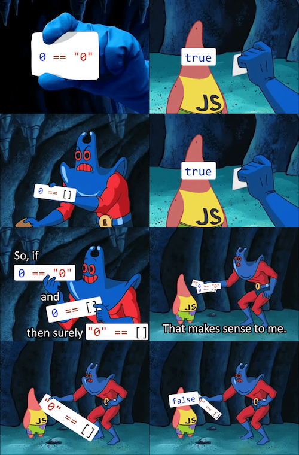

# Lexer et Parser

Ou l'art d'apprendre un ordinateur à lire

---

# C'est quoi ?

Algorythmes qui permettent de faire l'analyse lexicale (lexer) ou syntaxique (syntaxique).


---

## Un exemple

```
Le midi, je mange au ru pour 3€
```

---

## Un exemple (Analyse lexicale)

```
{MOT , "Le"}
{MOT , "midi"}
{VIRGULE}
{MOT, "je"}
{MOT, "mange"}
{MOT, "au"}
{MOT, "ru"}
{MOT, "pour"}
{NOMBRE, 3}
{EURO}
```

---

## Un exemple (Analyse syntaxique)

```
preposition:
  {MOT , "Le"}
  {MOT , "midi"}
{VIRGULE}
groupe nominal:
  {MOT, "je"}
  {MOT, "mange"}
  complement:  
    {MOT, "au"}
    {MOT, "ru"}
    complement:  
      {MOT, "pour"}
      argent:
       {NOMBRE, 3}
       {EURO}
```

---

## Un exemple

```c
enum TokenKind {
  WORD,
  COMMA,
  NOMBRE,
  EURO  
};

struct Token {
  enum TokenKind kind;
  char value[4096];
};
```

---

## Un exemple

```
Le midi, je mange au ru pour 3€

MOT -> [a-z,A-Z] | [a-z,A-Z]MOT // la valeur du mot est stoqué dans value
NOMBRE -> [0-9] | [0-9]CHIFFRE // la valeur du chiffre est stoqué dans value
VIRGULE -> ,
EURO -> €
```

---


## Un exemple

```
Le midi, je mange au ru pour 3€

PHRASE -> GROUPE_NOMINAL | suite de (token.kind == mot),PHRASE
GROUPE_NOMINAL -> SUJET VERBE | GROUPE_NOMINAL COMPLEMENT
SUJET -> (token.kind == mot && token.value == "je")
VERBE -> (token.kind == mot && token.value == "mange")
COMPLEMENT -> (token.kind == mot && token.value == "pour") ARGENT
 | (token.kind == mot && token.value == "au") suite de (token.kind == mot)
ARGENT -> NOMBRE EURO
```

---

## Les notations de Backus–Naur 

- [Grammar expression](https://en.wikipedia.org/wiki/Parsing_expression_grammar)
- [Backus–Naur form](https://en.wikipedia.org/wiki/Backus%E2%80%93Naur_form)
- [Extended Backus–Naur form](https://en.wikipedia.org/wiki/Extended_Backus%E2%80%93Naur_form)

---

# A quoi ca sert ? 


---

## Analyse de texte 

- [Merci app](https://www.merci-app.com/a-propos)

---

## Lecture de fichier 

- [Utf8](https://fr.wikipedia.org/wiki/UTF-8)
- [Png](https://en.wikipedia.org/wiki/Portable_Network_Graphics)

---

## Langage de programation 

- Les compilateur et interpreteur 
- Coloration syntaxique

---

## La coloration syntaxique

```
FONCTION fibabibobo(n: entier): entier
VARIABLES
	res : entier
DEBUT
	si n = 0 alors // Cas n = 0
		retourner 0
	fin si
	
	si n = 1 alors // Cas n = 1
		retourner 1
	fin si
	
	retourner fibo(n-1) + fibo(n-2) // Partie Récursive
FIN
```

---

## La coloration syntaxique

- [Helix](https://helix-editor.com/)
- [Tree-sitter](https://tree-sitter.github.io/tree-sitter/) 

---

## La coloration syntaxique

- Sequences : seq(rule1, rule2, ...) - This function creates a rule that matches any number of other rules, one after another. It is analogous to simply writing multiple symbols next to each other in EBNF notation.
- Alternatives : choice(rule1, rule2, ...) - This function creates a rule that matches one of a set of possible rules. The order of the arguments does not matter. This is analogous to the | (pipe) operator in EBNF notation.
- Repetitions : repeat(rule) - This function creates a rule that matches zero-or-more occurrences of a given rule. It is analogous to the {x} (curly brace) syntax in EBNF notation.
- Options : optional(rule) - This function creates a rule that matches zero or one occurrence of a given rule. It is analogous to the \[x\] (square bracket) syntax in EBNF notation.

---

## La coloration syntaxique

```
FONCTION fibabibobo(n: entier): entier
VARIABLES
	res : entier
DEBUT
	si n = 0 alors // Cas n = 0
		retourner 0
	fin si
	
	si n = 1 alors // Cas n = 1
		retourner 1
	fin si
	
	retourner fibo(n-1) + fibo(n-2) // Partie Récursive
FIN
```

---

## La coloration syntaxique

```js
function_definition: $ => seq(
  $.function_prototype,
  $.block
),
```

---

## La coloration syntaxique

```js
var_block_identifier: $ => choice('variables', 'VARIABLES'),

block_begin_identifier: $ => /[D,d][E,e,É,é][B,b][U,u][T,t]/,

block_end_identifier: $ => /[F,f][I,i][N,n]/,

block: $ => seq (
  optional(seq($.var_block_identifier, repeat($.var_definition))),
  $.block_begin_identifier,
  repeat($.statement),
  $.block_end_identifier
),  
```

---

## La coloration syntaxique

```js
statement: $ => choice(
  $.return_statement,
  $.if_statement,
),
```

---

## La coloration syntaxique

```js
if: $ => choice("si","SI"),
else: $ => choice("sinon","SINON"),
then: $ => choice("alors", "ALORS"),
if_end: $ => choice("fin si","FIN SI"),

if_statement: $ => seq(
  $.if,
  $.expression,
  $.then,
  repeat($.statement),
  optional(seq($.else,repeat($.statement),)),
  $.if_end
),
```

---

## La coloration syntaxique

```js
non_string_value: $ => choice($.int_value,$.float, $.expression),

expression: $ => choice(
  seq('(',$.non_string_value, ')'),     
  prec.left(seq($.non_string_value,'=',$.non_string_value)),
  prec.left(seq($.non_string_value,'<',$.non_string_value)),
  prec.left(seq($.non_string_value,'>',$.non_string_value)),
  prec.left(seq($.non_string_value,'+',$.non_string_value)),
  prec.left(seq($.non_string_value,'-',$.non_string_value)),
  prec.left(seq($.non_string_value,'*',$.non_string_value)),
  prec.left(seq($.non_string_value,'/',$.non_string_value)),
  prec.left(seq($.non_string_value,'%',$.non_string_value)),
),
```

---

## La coloration syntaxique 

```js
return: $ => choice("retourner", "RETOURNER"),

return_statement: $ => seq(
  $.return,
  $.value
),
    
value: $ => choice( $.string, $.non_string_value),
non_string_value: $ => choice($.int_value,$.float, $.expression),
int_value: $ => choice($.int,$.char, $.bool_value, $.variable_access, $.function_call),
function_call: $ => seq(field("function_name", $.identifier),
 '(',optional(seq(repeat(seq($.value,COMMA)),$.value)),')'),
```

---

## La coloration syntaxique 

```js
var_definition: $ => seq(
  repeat(seq(field("name",$.identifier),COMMA)),
  field("name",$.identifier),
  COLON,
  field("type",$.type),
),

type: $ => choice(
  'entier',
),
```

---

## La coloration syntaxique 

```js
function_identifier: $ => choice('fonction','FONCTION'),        

function_prototype: $ => seq(
  $.function_identifier,
  field("name",$.identifier),
  $.parameter_list,
  ':',
  $.type
),
```

---

## La coloration syntaxique 

Alors peut etre...


---

## Générateur et librairie 

Des générateurs : 

- [yacc](https://en.wikipedia.org/wiki/Yacc)
- [bison](https://en.wikipedia.org/wiki/GNU_Bison)
- [Tree-sitter](https://tree-sitter.github.io/tree-sitter/) 

Des librairies :

- [Spirit](https://en.wikipedia.org/wiki/Spirit_Parser_Framework)
- [Nom](https://github.com/rust-bakery/nom)

---

## Comment ca marche...

C'est quoi les algos en fait... 


---

## Des algos : 

- [Recursive descent parser](https://en.wikipedia.org/wiki/Recursive_descent_parser)
- [Recursive ascent parser](https://en.wikipedia.org/wiki/Recursive_ascent_parser)
- [Pratt parser](https://en.wikipedia.org/wiki/Operator-precedence_parser) 
- [Tail recursive parser](https://en.wikipedia.org/wiki/Tail_recursive_parser)
- [Botom up parsing](https://en.wikipedia.org/wiki/Bottom-up_parsing)
- [Shift reduce parser](https://en.wikipedia.org/wiki/Shift-reduce_parser)
- [Scanerless parser](https://en.wikipedia.org/wiki/Scannerless_parsing)
- [Finite state machine](https://en.wikipedia.org/wiki/Finite-state_machine)

---

## 3 types de Lexer/Parser


---

## Lexer/Parser [LL](https://en.wikipedia.org/wiki/LL_parser)

- **L** eft to right
- **L** eft derivation

---

## Left derivation

```
Une règle sympatique :
S -> 1 | a | S + S

Une phrase sympathique :
1 + 1 + a
```

---

## Left derivation

```
S + S 
S + S + S
1 + S + S
1 + 1 + S
1 + 1 + a 
```

---

## Lexer/Parser [LL](https://en.wikipedia.org/wiki/LL_parser)

- Rapide  
- Simple à implementer
- Très adapté pour du texte et du code

---

## Lexer/Parser [LR](https://en.wikipedia.org/wiki/LR_parser)

- **L** eft to right
- **R** ight derivation

---

## Right derivation

```
Une règle sympatique :
S -> 1 | a | S + S

Une phrase sympathique :
1 + 1 + a
```

---

## Right derivation

```
S + S
S + S + S
S + S + a
S + 1 + a
1 + 1 + a
```

---

## Lexer/Parser [LR](https://en.wikipedia.org/wiki/LR_parser)

- Couvre plus de langages que LL
- Compliquer à implementer
- Pratique pour flex alors qu'un LL suffirait très bien

--- 

## Ya des limitation...


---

## Le problème des guillemets

```c
michel = "Pour vendre des velux";
if (1 == 0) {
  printf("Le fameux bug quantique...\n");
}
```

---

## Le problème des guillemets

```c
michel = "Pour vendre des velux;
if (1 == 0) {
  printf("Le fameux bug quantique...\n");
}
```

---

## Le problème des guillemets

```c
michel = "Pour vendre des velux";
if (1 == 0) {
  printf(Le fameux bug quantique...\n");
}
```

---

## Le [parser combinatoire](https://en.wikipedia.org/wiki/Parser_combinator)

- [Combinatoire des mots](https://fr.wikipedia.org/wiki/Combinatoire_des_mots)
- Combiner des parsers
- Plutot lié au paradigme fonctionnel
- Rapide sur du bit à bit

---

## Petit point sur les langages

- Lexer -> Token
- Parser(Token) -> [AST](https://en.wikipedia.org/wiki/Abstract_syntax_tree) (Abstract syntax tree)
- Ir(AST) -> {Assembly | Bytecode -> Vm}

---

## 2~3 type de langages

- Compilé -> [Assembly/Assembleur](https://fr.wikipedia.org/wiki/Assembleur) (Des programmes natifs)
- Interpreté -> {[Bytecode](http://vega.lpl.arizona.edu/python/lib/bytecodes.html) -> [Vm](https://en.wikipedia.org/wiki/Virtual_machine)}
- [Jvm](https://fr.wikipedia.org/wiki/Machine_virtuelle_Java) / [Wasm](https://webassembly.org/)

---

## [LLVM](https://llvm.org/)

- [Une video sympa](https://www.youtube.com/watch?v=BT2Cv-Tjq7Q)
- Librairie de compilation qui produit du code optimisé
- Utilisée nottamment par les langages Rust, Zig, et C via clang
- [Peut compiler vers du wasm](https://github.com/tsoding/snake-c-wasm)

---

## Et maintenant la demo :


---

## La calculette

```
-(4+3)*(5-3)
```

---

## La calculette (Analyse Lexicale)

```
NUMBER -> [0-9]*
PLUS -> +
MINUS -> -
TIMES -> *
DIVIDE -> /
LPAREN -> (
RPAREN -> )
```

---

## La calculette (Analyse Lexicale)

```c
typedef enum TokenKind {
  NUMBER,
  PLUS,
  MINUS,
  TIMES,
  DIVIDE,
  LPAREN,
  RPAREN
} TokenKind;

typedef struct Token {
  TokenKind kind;
  int value;
} Token;
```

---

## La calculette (Analyse Lexicale)

```c
typedef struct Lexer {
  char c;
  int cursor;
  char content[4096];
  int is_finish;
} Lexer;
```

---

## La calculette (Analyse Lexicale)

```c
void lexer_advance(Lexer *l) {
  if (!(l->is_finish)) {
    if (strlen(l->content) <= (l->cursor + 1)) {
      l->is_finish = 1;
    } else {
      l->cursor += 1;
      l->c = l->content[l->cursor];
    }
  }
}
```

---

## La calculette (Analyse Lexicale)

```c
void lexer_skip_whitespaces(Lexer *l) {
  while (l->c == ' ' || l->c == '\t')
    lexer_advance(l);
}

int is_num(char c) { return (c > 47 && c < 58); }
```

---

## La calculette (Analyse Lexicale)

```c
Token *lexer_get_token(Lexer *l) {
  Token *res = malloc(sizeof(Token));
  int i = 0;
  char temp[4096];

  lexer_skip_whitespaces(l);

  if (is_num(l->c)) {
    while (is_num(l->c) && !(l->is_finish)){
      temp[i] = l->c;
      i++;
      lexer_advance(l);
    } 
    temp[i] = '\0';
    res->kind = NUMBER;
    res->value = atoi(temp);
    return res;
  } else {...
```

---

## La calculette (Analyse Lexicale)

```c
  switch (l->c) {
    case '+':
      lexer_advance(l);
      res->kind = PLUS;
      return res;
    case '-':
      lexer_advance(l);
      res->kind = MINUS;
      return res;
    case '*':
      lexer_advance(l);
      res->kind = TIMES;
      return res;
    case '/':
      lexer_advance(l);
      res->kind = DIVIDE;
      return res;
    case '(':
      lexer_advance(l);
      res->kind = LPAREN;
      return res;
    case ')':
      lexer_advance(l);
      res->kind = RPAREN;
      return res;
    default:
      fprintf(stderr, "Ca ne sert à rien\n");
      exit(EXIT_FAILURE);
    }
```

---

# Merci pour votre écoute !