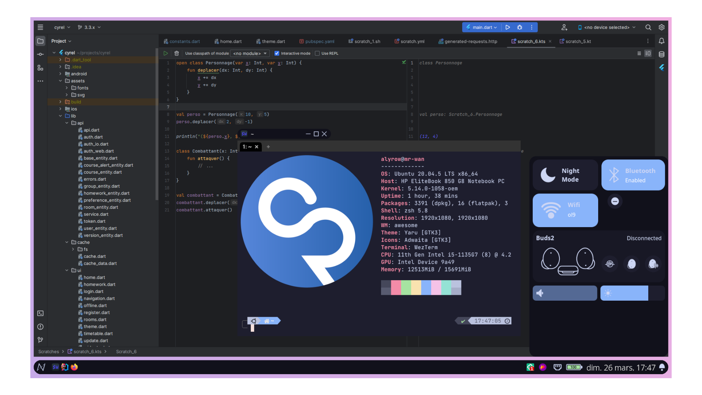
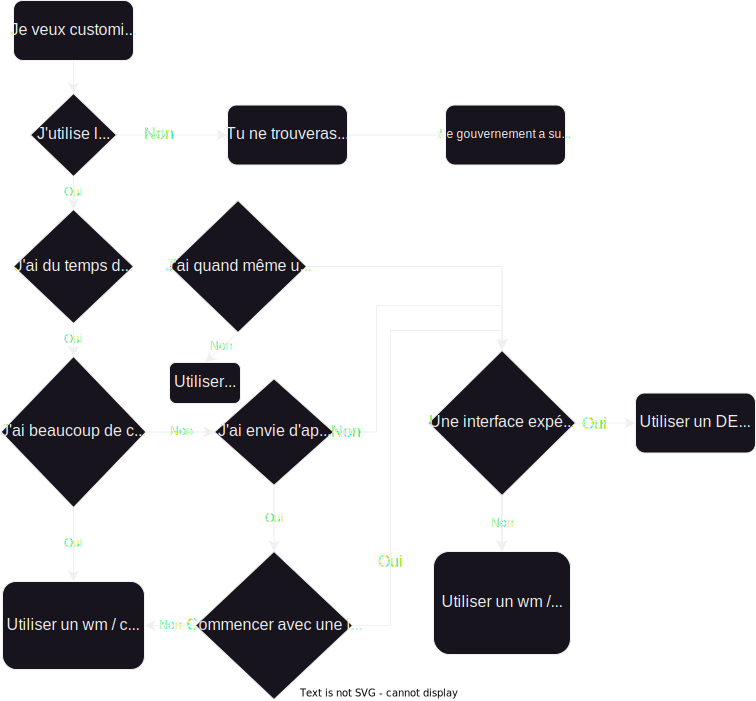
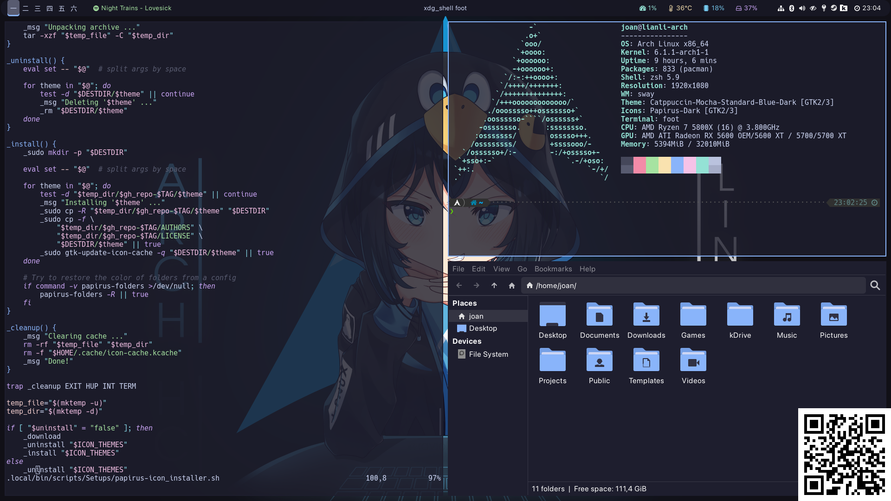
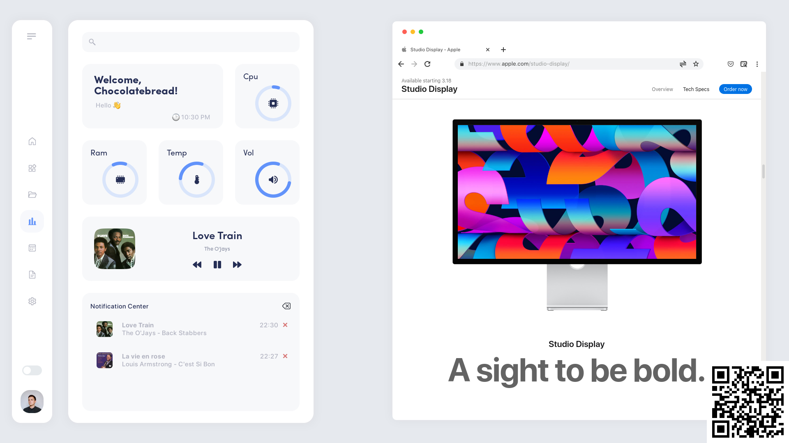
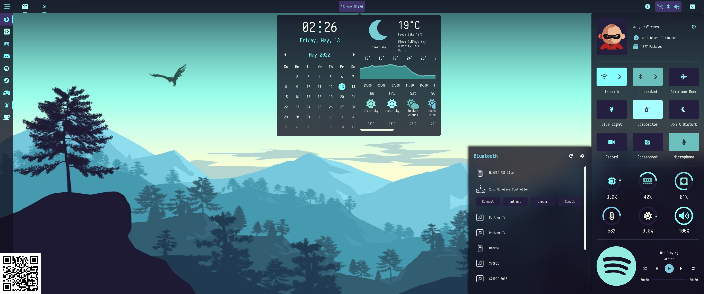

# Ricing

Ou l'art de personnaliser son ordinateur

---

## Qu’est-ce qui vous attend ?

---

## Qu’est-ce qui vous attend ?

- Reprenons les bases
- Partons de A à Z

---

## On **A**llume la machine

- Power-on self test
- UEFI initialise le matériel nécessaire au démarrage
- NVRAM lu pour voir quel .efi lancer

---

## Le **B**ootloader se lance

- GRUB
- Limine
- rEFInd
- systemd-boot
- Plop Boot Manger

---

## **C**'est au tour du kernel de se lancer

---

## On lance **D**onc ensuite l'initramfs

Créé un système de fichier (temporaire) vide qui va permettre de charger des modules nécessaires au lancement de son
système (disque dur, encryption, ...)

---

## Au tour de l'**E**arly userspace

Les différents modules du kernel sont chargés, déchiffrage, plymouth.

Le vrai système de fichier est monté puis définit comme la racine.

---

## **F**inalement le premier processus est lancé

Systemd...

Quand il a tout lancé il lance au choix :

- getty
Terminal virtuel initialisé et protégé derrière un invité qui demande login et mdp
- Un display manager
Session graphique

---

## Parlons enfin de **G**raphique

1. Display manager
2. Xorg
    1. Window manager
    2. Compositeur
3. Wayland
4. Environnement de bureau

---

## Ecran de connexion grap**H**ique (aka display manager)

- gdm (Support de themes -> changer arrière-plan et couleurs)
- [sddm](https://github.com/sddm/sddm) (Support de themes -> couleurs, images, positions)
- [lightdm](https://github.com/canonical/lightdm) (Support de "greeter")

---

## Ecran de connexion grap**H**ique (aka display manager)

|    [Credits](https://www.reddit.com/r/unixporn/comments/84wypv/lightdmwebkit2greeter_ricing_the_greeter/) |    [Credits](https://www.reddit.com/r/unixporn/comments/dy66ue/lightdmtinygreeter_tiny_material/)      |
|-----------------------------------------------------------------------------------------------------------------------------------------------------------|--------------------------------------------------------------------------------------------------------------------------------------------------------|
|    [Credits](https://github.com/nautilor/nord-sddm)                         |    [Credits](https://store.kde.org/p/1312658) |

---

## Serveur graph**I**que

- Xorg
- Wayland

---

### Xorg

- Utilisation la plus répandue
- Fonctionne sous la forme d'un ensemble de librairies
  - Xlib
  - XCB (plus récente et moderne)

---

### Xorg

- Window manager
  - Gère les fenêtres
  - Peut gérer l'interface (barre de tache)
  - Peut gérer les notifications
  - Peut gérer les keybindings
  - Window manager les plus connus : [awesomewm](https://awesomewm.org/), [i3](https://i3wm.org/), [openbox](http://openbox.org/), [xfwm](https://docs.xfce.org/xfce/xfwm4/start), [mutter](https://gitlab.gnome.org/GNOME/mutter), [kwin](https://en.wikipedia.org/wiki/KWin)
- Compositeurs
  - Gère les "effets" (transparence, floue, peut empêcher le screen-tearing, ...)
  - Compositeurs connus : [Johann Sebastian Bach](https://en.wikipedia.org/wiki/Johann_Sebastian_Bach), [picom](https://github.com/yshui/picom), [mutter](https://gitlab.gnome.org/GNOME/mutter), [kwin](https://en.wikipedia.org/wiki/KWin)

---

### Wayland

- Remplace Xorg (plus facile à développer et maintenir)
- Un serveur wayland est appelé compositeur (fait office de compositeur)
- Un compositeur fait aussi office de window manager
- Plus optimisé et rapide que Xorg
- Compatible avec les applications faites pour Xorg grâce à Xwayland
- Ajoute de la sécurité entre l'intéraction entre les applications (cause souvent des soucis pour les partages d'écrans)
- Nvidia...
- Compositeurs les plus connus : [sway](https://github.com/swaywm/sway), [hyprland](https://hyprland.org/), [weston](https://gitlab.freedesktop.org/wayland/weston), [mutter](https://gitlab.gnome.org/GNOME/mutter), [kwin](https://en.wikipedia.org/wiki/KWin)

---

## **J**'ai oublié plymouth

- Permet d'avoir un démarrage (et arrêt) graphique
- Personnalisable. [Une référence](https://github.com/adi1090x/plymouth-themes)

---

## Des**K**top Environnement

- Rassemble :
  - Un window manager (avec compositeur) ou compositeur (wayland)
  - Un écosystème d'applications
  - (facultativement) Un display manager
- Patte graphique unifié et partagé
- Plus facile pour des gens qui débutent ou qui ne veulent pas s'embêter avec des détails techniques
- Exemple :
  - [GNOME](https://www.gnome.org/) basé sur GTK
  - [KDE Plasme](https://www.kde.org/plasma-desktop) basé sur Qt
  - [Xfce](https://xfce.org/) basé sur GTK
  - [Cutefish](https://cutefish-ubuntu.github.io/) basé sur Qt

---

## Des**K**top Environnement

|    [Credits](https://youtu.be/GtvbT_p0HMk)                                                   |    [Credits](https://www.kde.org/plasma-desktop)                                         |
|------------------------------------------------------------------------------------------------------------------------------------------|-----------------------------------------------------------------------------------------------------------------------------------------------------------------------------|
|    [Credits](https://news.itsfoss.com/xfce-4-18-release/) |    [Credits](https://www.opensourcefeed.org/cutefish-os-0.6-release/) |

---

## **L**es shells

Il n'y a pas que l'interface graphique : il y a les shells.

> Interpréteur de commande, fournit une interface à l'utilisateur pour interagir avec son pc

- [bash](https://www.gnu.org/software/bash/)
- [zsh](https://www.zsh.org/)

---

## **L**es shells

Il n'y a pas que l'interface graphique : il y a les shells (POSIX compliant).

> Interpréteur de commande, fournit une interface à l'utilisateur pour interagir avec son pc

- [bash](https://www.gnu.org/software/bash/)
- [zsh](https://www.zsh.org/)
- ~~[fish](https://fishshell.com/)~~

---

# **M**aintenant passons au sujet qui nous intéresse

---

## Qu'est-ce qu'o**N** peut customiser ?

- Interface
  - Window manager / compositeur wayland
  - Curseurs
  - Barre de recherche / Spotlight
  - Notifications
  - Desktop Environnement
- Shell
- Bootloader (grub)
- Plymouth
- Display manager
- Bonus

---

## B**O**n commençons par l'interface

---

## **P**remièrement sway / i3

https://github.com/joan31/dotfiles-sway

---

## Débar**Q**ue alors : awesomewm

https://github.com/ChocolateBread799/dotfiles

---

## Débar**Q**ue alors : awesomewm

https://github.com/Kasper24/KwesomeDE

---

## Débar**Q**ue alors : awesomewm

<video style="display:block; margin: 0 auto; height: 50vh" controls loop src="img/awesome3.mp4"></video>

Coming soon™

---

## Débarque alors l'enfer d'**U**buntu

- Versions 20.04 & 22.04
- sway 1.4 vs 1.8
- Dernière version d'awesome : 2019 (4.3) -> 1 588 commits sur leur github depuis

---

## **V**oilà la solution

Installer une distribution "rolling-release"

---

## **V**oilà la solution

En vrai j'ai réalisé une solution alternative :

**lulu**

- A un paquet pour awesome
- Simple d'utilisation (`lulu install awesome-git`)

  
 https://github.com/alyrow/lulu/releases/tag/1.0.5

---

## **W**orking with desktop environment

La majorité des DE (GNOME, KDE Plasma, Xfce) supportent des themes.

Il existe des boutiques des themes : https://www.pling.com/

- Thèmes pour GTK 3/4 (GNOME)
- Thèmes pour KDE Plasma
- Thèmes pour Xfce

---

## **W**orking with desktop environment

https://store.kde.org/p/1400409

---

## **W**orking with desktop environment

https://www.pling.com/p/1477941/

---

## bash **X** zsh

- Upgrade de bash
- Completion
- ...
- Themable
- Plugins

[Oh My ZSH](https://ohmyz.sh/)

https://github.com/romkatv/powerlevel10k

---

## Corpauration theme but it's only grub **Y**et

_insert photo_

https://github.com/Corpauration/corpauration-theme

---

## Un **Z**est pour finir

- Plymouth

https://github.com/adi1090x/plymouth-themes

Détail pour installer un thème + un script pour tester le thème sans redémarrer

- Pour les pc hp : pour changer le logo de l'école

